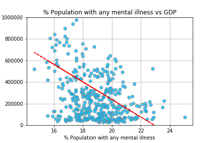
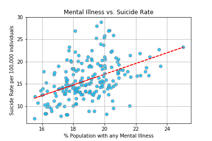

# Mental Health in the US
## Members: Brian, Mukta, Hugo
### Purpose
Data Analysis correlating mental health illness with US Census data, including Census metrics around poverty, health insurance, unemployment.

### Findings

### Requirements
1. Python 3.73
2. statsmodels==0.9.0
3. matplotlib==3.0.3
4. pandas==0.24.2
5. numpy==1.16.2
6. requests==2.21.0
7. scipy==1.2.1
8. seaborn==0.9.0
9. census==0.8.13
10. folium==0.10.0
11. gmaps==0.9.0
12. us==1.0.0

### Map of the severity of mental health in the US
[map_MentalHealth.html](Output/map_Mental_Health.html)

### Graphs created with Matplotlib for this project

